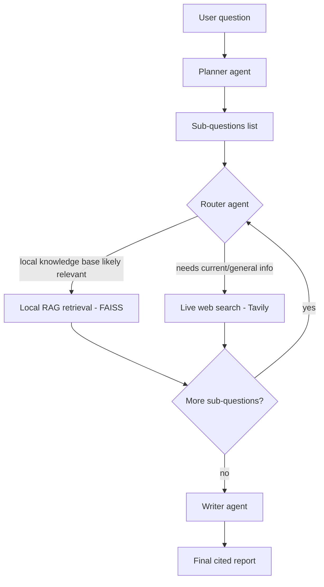

# Agentic RAG Research Assistant

A multi-agent research system: given a question, it autonomously plans
sub-questions, decides per sub-question whether to consult a local knowledge
base (RAG) or search the live web, researches each one, then synthesizes a
single cited report. Orchestrated as a stateful graph using **LangGraph**,
served via **FastAPI**, with a **Streamlit** frontend, and containerized
with **Docker**.

## Architecture



**Why this counts as "agentic" and not just RAG:** the system doesn't follow
a fixed pipeline. The router agent makes an independent decision *per
sub-question*, and the graph loops back on itself until all sub-questions are
resolved before handing off to the writer. That looping, conditional control
flow — decided by the LLM at runtime, not hardcoded by you — is the core
difference between "agentic" and a single-shot RAG chatbot.

## Components

| Component | File | Role |
|---|---|---|
| Agent graph | `graph.py` | LangGraph `StateGraph` defining planner, router, researchers, writer |
| Local RAG | `retriever.py` | Builds a FAISS index from PDFs in `knowledge_base/` (local embeddings, no API cost) |
| Web search tool | `graph.py` (via `TavilySearchResults`) | Live web search for anything outside the local knowledge base |
| API | `api.py` | FastAPI endpoint (`POST /research`) exposing the graph |
| UI | `streamlit_app.py` | Calls the API and renders sub-questions + final report |
| Container | `Dockerfile` | Packages the API for deployment |

## Setup

1. Install dependencies:
   ```bash
   pip install -r requirements.txt
   ```

2. Get free API keys:
   - Gemini: https://aistudio.google.com/app/apikey
   - Tavily (web search): https://tavily.com (free tier, no card required)

3. Copy `.env.example` to `.env` and fill in your keys:
   ```bash
   cp .env.example .env
   ```

4. (Optional) Drop a few PDFs into `knowledge_base/` to enable local RAG
   routing. Leave it empty and the agent will always use web search — the
   app still works either way.

5. Run the backend:
   ```bash
   uvicorn api:app --reload
   ```

6. In a second terminal, run the frontend:
   ```bash
   streamlit run streamlit_app.py
   ```

7. Ask a research question in the Streamlit UI and watch the agent plan,
   route, research, and write the report.

## Running with Docker (backend only)

```bash
docker build -t agentic-rag-assistant .
docker run -p 8000:8000 --env-file .env agentic-rag-assistant
```

Then point the Streamlit app's backend URL field at `http://localhost:8000/research`.

## Interview talking points

- **Why LangGraph over a simple LangChain chain?** A chain is linear; this
  problem needs a *variable number of loop iterations* (one per sub-question)
  and a *runtime branching decision* (local vs web) — that's a graph with
  conditional edges and cycles, which LangChain's basic chains can't express
  cleanly.
- **Why separate the API (FastAPI) from the UI (Streamlit)?** This mirrors
  real production systems — the agent logic is a service that could be
  called by any client (a UI, another backend, a Slack bot), not tied to one
  frontend.
- **Why local embeddings but a hosted LLM?** Embeddings are computed often
  (every chunk, every query) and don't need a huge model, so keeping them
  local avoids cost/latency. Generation and routing decisions genuinely
  benefit from a stronger hosted model, so those go through Gemini.
- **What would you improve for production?** Add retries/timeouts around the
  web search and LLM calls, cache repeated sub-question lookups, add
  streaming so the UI shows progress per sub-question instead of waiting for
  the whole graph to finish, and swap the router's LLM call for a cheaper
  classifier if cost became a concern at scale.
- **Known limitation:** the router's local-vs-web decision is itself an LLM
  call, so it can occasionally misroute — worth mentioning if asked about
  weaknesses, along with how you'd measure/fix it (e.g. logging routing
  decisions and spot-checking accuracy).

## Tech stack

`Python` · `LangGraph` · `LangChain` · `FAISS` · `sentence-transformers` ·
`Gemini API` · `Tavily API` · `FastAPI` · `Streamlit` · `Docker`
